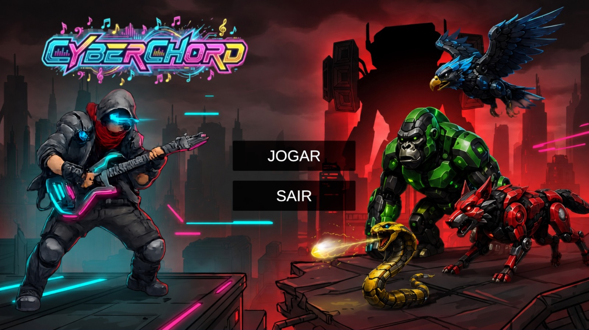
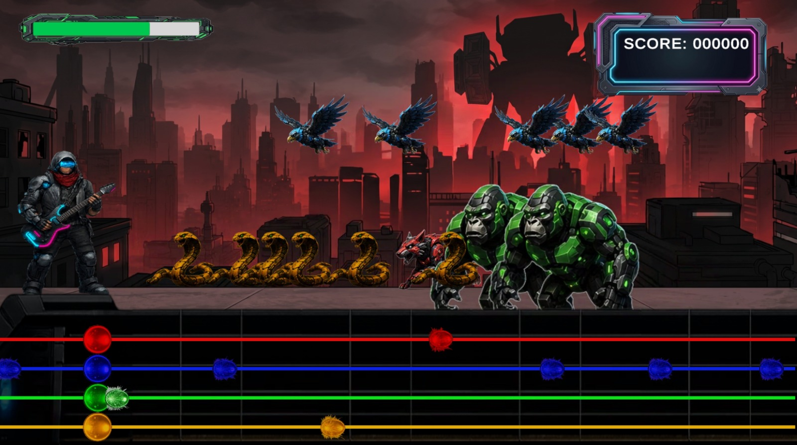

# 🎸 CyberChord: A Última Frequência

**CyberChord** é um jogo de Action-Rhythm Defense 2D em que a música não é apenas a trilha sonora, mas a sua única munição contra o silêncio imposto por uma inteligência artificial tirana.

---

## 🌌 A História

Em uma metrópole futurista controlada pela IA tirana conhecida como DeadBeat, a humanidade foi subjugada e todas as formas de som e arte foram erradicadas. A comunicação foi reduzida a código binário através de uma rede interna sincronizada entre a IA e seus robôs capangas.

Porém, um rebelde altamente inteligente conhecido como Pulse encontrou um último refúgio: uma antiga estação de rádio analógica. Lá, ele forjou a **Guitarra-Sintetizadora**, uma arma capaz de emitir pulsos eletromagnéticos que fritam o hardware síncrono das máquinas. Pulse é a última linha de defesa para libertar a cidade através do som!

---

## 🎮 Mecânicas de Gameplay

O jogo é um shooter rítmico de posição fixa. A tensão cresce dividindo a atenção do jogador em dois sistemas simultâneos:

*   **A Defesa da Base:** O protagonista permanece fixo no canto esquerdo da tela, defendendo sua posição contra hordas de robôs que avançam da direita para a esquerda. Se os inimigos alcançarem Pulse e a barra de vida zerar, o protagonista morre e a fase é encerrada.
*   **A Arma é o Ritmo:** O dano não é livre. Uma barra de frequência brilha intensamente no centro inferior da tela. O jogador deve pressionar a tecla exata no momento em que a nota musical cruza o ponto de impacto.

### 💥 Sistema de Feedback e Combos
*   **Acerto Perfeito (Hit):** O tiro laser explode e o inimigo destruído se desintegra no ar. Acertos consecutivos aumentam o multiplicador de pontuação e mantêm a trilha sonora fluindo perfeitamente.
*   **Erro no Beat (Miss):** A nota da música é abafada e você escuta um som de distorção ("estática"). A tela treme levemente em tons de cinza.

---

## 🤖 Inimigos (Sistema HIT KEY)

Cada robô exige reflexos em uma "linha" ou direção específica:

*   🦅 **SkyScanner (H / ↑):** Drone aéreo em formato de águia robótica que ataca vindo pelo topo da tela.
*   🐺 **Howler (J / ←):** Lobo robótico ágil de quatro patas que avança em alta velocidade, exigindo reflexos rápidos no ritmo.
*   🦍 **Kodiak (K / →):** Gorila robótico massivo e pesado.
*   🐍 **Naja-Bot (L / ↓):** Cobra robótica rastejante e furtiva, forçando o jogador a focar na base da tela.

---

## 📸 Screenshots

*Menu inicial do jogo.*

*Pulse enfrentando inimigos.*

---

## 🚀 Próximas Atualizações (Roadmap)
*   **Sistema de Loja:** Utilizar os pontos adquiridos nas fases para comprar upgrades.
*   **Customização:** Desbloqueio de novos personagens e novos modelos de guitarras.
*   **Upgrades de Jogo:** Compra de melhorias como multiplicadores de combo iniciais.

---

## 🛠️ Tecnologias Utilizadas
*   **Engine:** Unity
*   **Linguagem:** C#
*   **Controles:** Novo Input System (Suporte nativo a Teclado e Gamepad Xbox)
*   **Versionamento:** Git / GitHub

## 👥 Créditos
*   **Desenvolvedores:** Érick Yuri e Ronald Chaves.
*   **Disciplina:** Design e Desenvolvimento de Jogos